# 生成节目单的Python脚本使用方法介绍

## 简介

- 该脚本是利用Python爬虫来获取网页中节目条目，并根据模板格式写入EXCEL表格。目前爬取的源网页是电视猫(http://tvmao.com/)。

- 所有内容以及以后的更新都会发布在GitHub上，地址(https://github.com/SongJLG/TVPL_Spider/)。

- 脚本还很初级，会继续完善更新。大家有什么建议和需求，可以联系我。如有有兴趣也可以自行在GitHub上贡献代码。

## 使用须知

- 代码基于Python 2.7 。如果需要在自己的电脑上使用，请安装2.7版本的Python。

- 所依赖的Python包括 BeautifulSoup4、lxml、xlwt、xlrd和xlutils。所以安装完Python，请安装这些第三方的包。
如果需要在浏览器执行，还需要安装 “ipython notebook” 。

## 使用流程

1. 在 https://github.com/SongJLG/TVPL_Spider/ 上下载该项目。找到 TVPL_Spider/Spider/IPy_Nb文件夹里的两个文件，分别是“TVPLSpider_TVMAO.py”、“Src_Spider.ipynb”。
同时在xls_test_mould文件夹里有6个EXCEL表格。将这些都放在同一个文件夹里，请以因为字符来命名文件夹。如图：
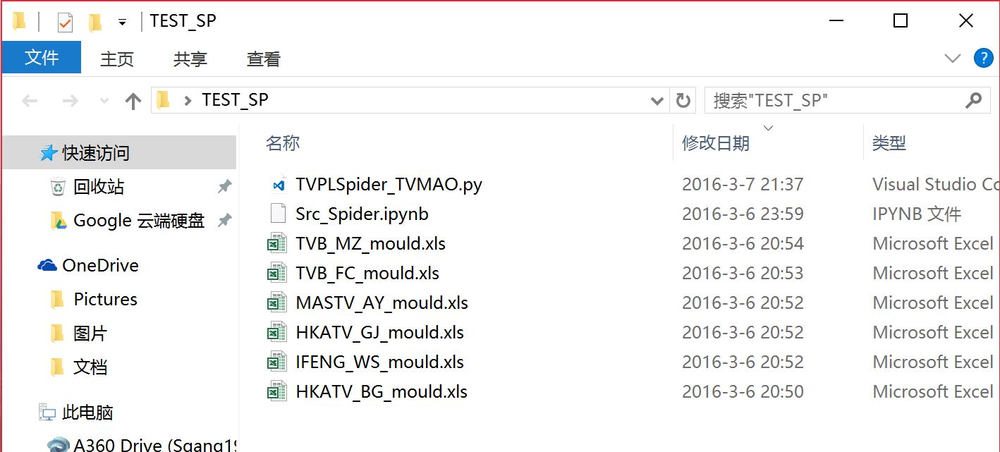

2. 在文件夹中6个EXCEL表格分别是6个频道的模板，文件名包含各种频道拼音的首字母，应该不难将其与频道对应。同时请务必对这6个表格做任何更改，最好都不打开它们。模板大概类似下图：
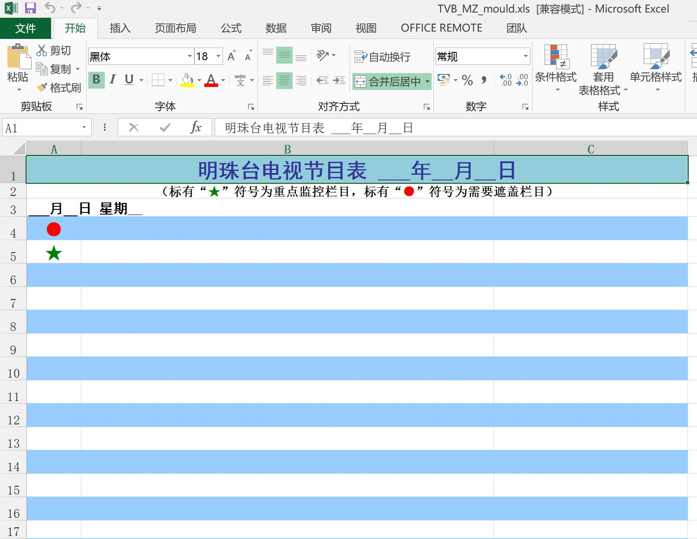

3. 脚本是“TVPLSpider_TVMAO.py”，有两种方法执行，操作流程都一样。下面会演示简单的一种操作方法。

4. 第一种是在命令提示符里执行，不推荐使用。两步：1.cd命令 进入该文件夹；2.python命令执行该脚本。执行过程大概如下图，两条命令已标红：
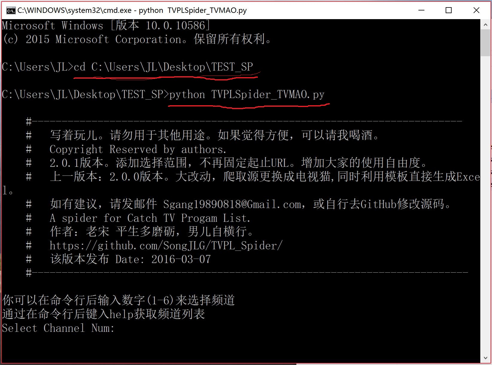

5. 第二种浏览器运行，先进入命令提示符，输入 ipython notebook。自动跳出浏览器，然后找到存放脚本以及模板的文件夹。点击“Src_Spider.ipynb”，打开它。
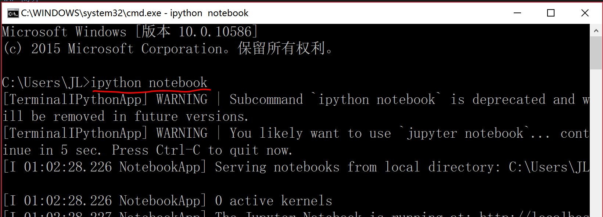
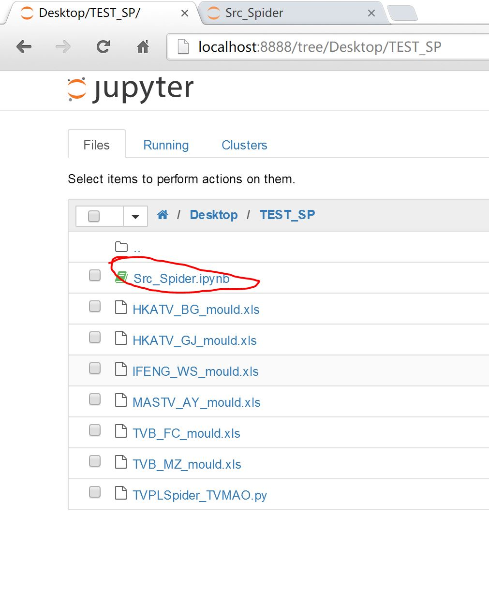
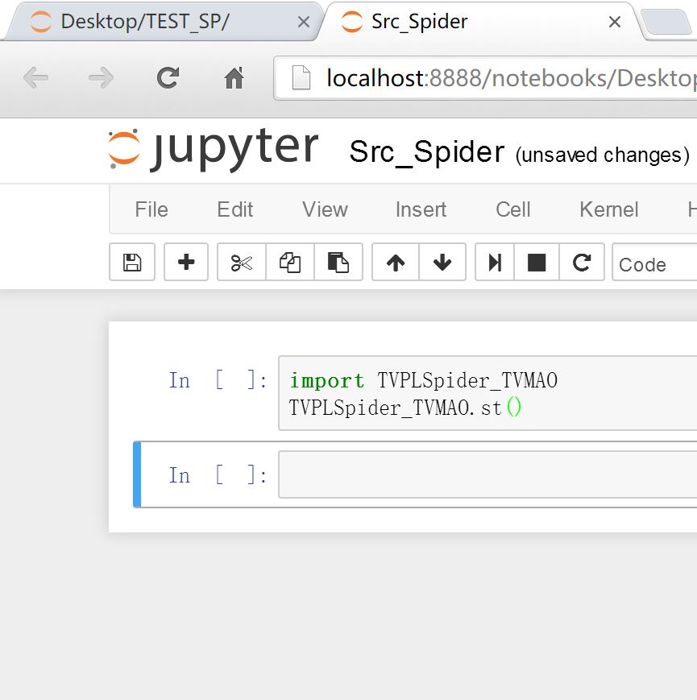

6. 同时按下shift+enter 执行该脚本。此时需要第一次输入 Select Channel Num: ，选择所需要爬取的频道的序号，按下回车继续。序号为1-6，各自所对应的电视台可以通过输入help来查看。
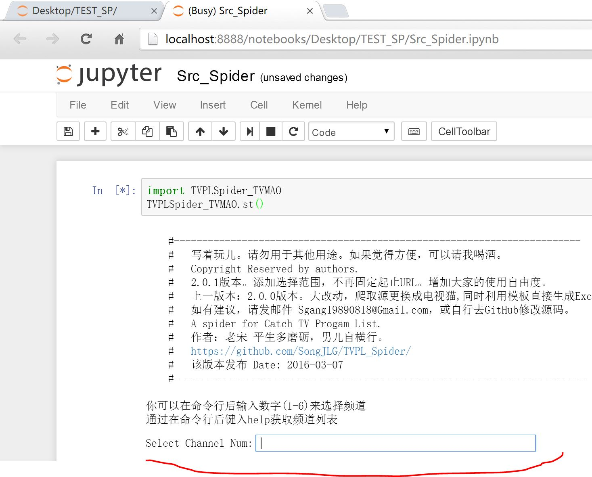
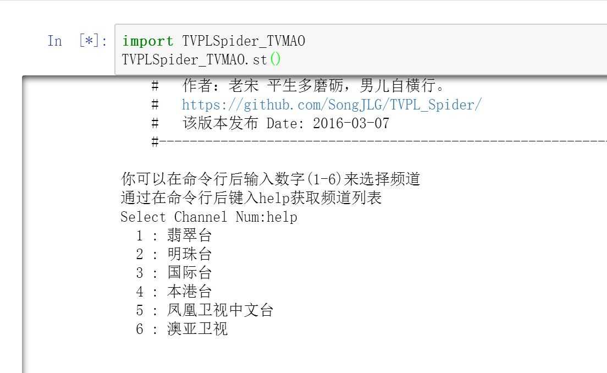

7. 在选择了频道之后，需要第二次第三次输入。分别是 Start URL Num: 、End URL Num:。选择的是爬取范围，同样按下回车继续执行。
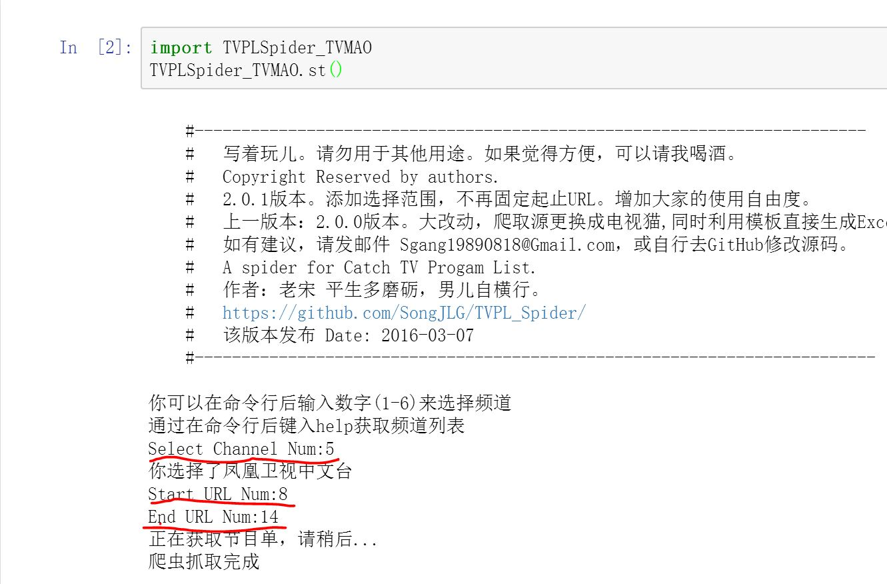

8. PS：关于这两次键入的数字。需要查看电视猫网站，选择频道，全天节目单；然后查看所需爬取的URL，如下图红色所圈的数字。一般来说周末做下一周的单，下周一会是8，下周二是9，依次类推。
只需要输入开始的和结束的。
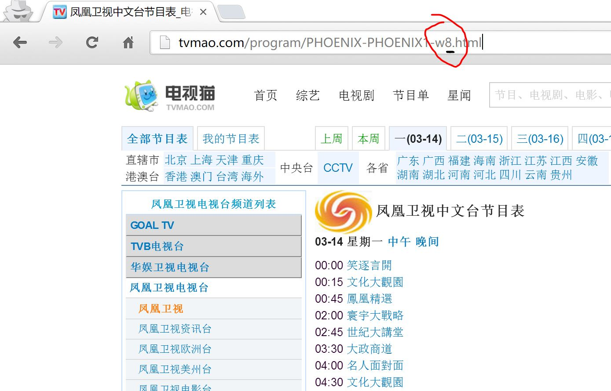

9. 键入完成之后按回车，脚本执行。执行完成之后，文件夹里会多出一些结尾为 Done 的EXCEL表格。这些便是生成的节目单。请拷走，再调整。
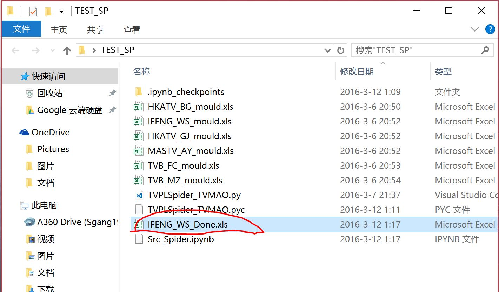
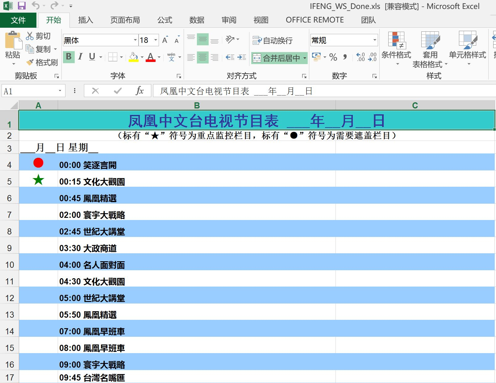

10. 其他频道循环上面的操作流程。

11. 所以频道的EXCEL表格都生成之后，请拷走再做调整。并且在文件夹里删除。但请务必保留模板，并不做任何修改，包括文件名。

##调整说明

- 模板中“（标有“★”符号为重点监控栏目，标有“●”符号为需要遮盖栏目）”这一句生成之后，五星和圆形本身颜色没有保留，请手动修正。

- 生成的节目单中暂不支持自动添加日期，需手动添加。每一天节目之间会隔四行。

- 某些频道节目的某些条目会有剧情简介等等，会使条目过长，请手动删除多余内容。

- 为保证时间节目不错位，所以时间和节目条目在一个单元格中，如需分隔，请手动使用EXCEL的分列功能，几秒钟便可分列。

- 需要重点标准的节目，请手动标注。

- 据反映，电视猫节目单会有偶尔不准的问题，如有必要请跟官网核对。

## 下一版本更新计划

- 将官网作为爬取源，提高准确性，避免再次核对，减轻大家的工作量

- 增加日期自动填入

- 采用一个表格多SHEET的方式生成节目单

- 添加一个常驻后台的线程，使得脚本定期自动运行。更方便。
